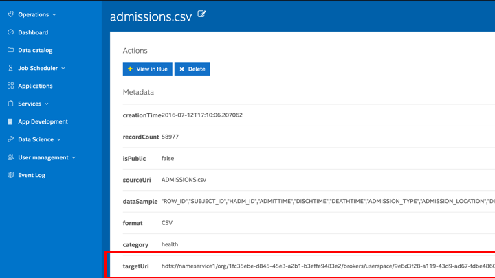

# readmissions-risk-scorer
This is a temporary repo for the Intel-TAP readmission risk scoring model reference architecture

# Executive Summary

## 1. The Problem

The Affordable Care Act established the Hospital Readmissions Reduction Program (HRRP), which requires the Centers for Medicare & Medicaid Services (CMS) to promote quality health care for Americans. To this end the CMS is required to reduce payments to hospitals with excessive readmissions. Additionally, hospitals incur unnecessary costs when patients are readmitted for conditions that could have addressed or mitigated during the patient's initial admission. As a result, hospitals are seeking ways to reduce readmissions rates.

## 2. Solution Summary

Advanced analytics on large patient datasets allow analytics professionals and data scientists to find patterns in patient readmission data. From these patterns, models can be biult which enable hospitals to identify the most at-risk patients before they are discharged and apply an appropriate intervention.  

Intel's Trusted Analytics Platform (TAP) uses indsutry standard Open Source tools (e.g. Cloudera Hadoop, Docker, and CloudFoundry) to provide a consolidated platform for quickly testing, developing and deploying advanced analytics applications on arbitrarily large datasets.


This solution to reducing hospital readmissions will consist of five essential steps:

1. Loading the relevant patient record data into the TAP Hadoop Cluster
2. Load and explore the data, process the data, and engineer features for use in predictive modeling.
3. Train a preditive model and validate it's performance before deployment.
4. Deploy a the predictive model as an API that can be used by an application.
5. Build an application that allows a practitioner to use the model's output as part of the discharge planning process.


## 3. How to Use the Solution

## 4. What Does the Solution Contain

## 5. Solution Background

## 6. Adoption Roadmap

This intent is for this repo to be a one-stop source for everything you need to take your own hospital patient data, load that data into TAP, extract and process the relevant features, and train a model to predict which patients are likely to be readmitted within some amount of time.

This tutorial takes as given that you have access to a running TAP VPC (version 0.7), have access to patient data in CSV format, have permissions to upload data to the HDFS data catalog, and can create Jupyter notebook instances.

Additionally, there are several assumptions about skills and familiarity with technology, specifically:
  * You are familiar with iPython or Jupyter notebooks.
  * You are familiar with Spark
  * You can write SQL queries

## Overview
1. First, we will cover how to upload patient data to the Data Catalog.
2. Second, we will demonstrate how to create a Jupyter notebook running Pyspark and load the patient data for analysis.
3. Next, we will select a classifier model to identify patients at risk of readmission.
4. Then, we will discuss how to tune model parameters, evaluate the model's performance, and discuss common risks and 'gotchas' to be aware of when modeling.
5. Finally, we will show how to deploy the model as a REST api so that medical staff can begin identifying which patients are most at risk of readmission.         

# 1. Loading the data into the Data Catalog

* First, log in to the console for your TAP VPC. It should look something like this:


* To load your data, select the "Submit Transfer" tab. You upload data files directly from your local machine or you can pass a link. You can also `ssh` or `sftp` into `cdh-launcher` and from there you can directly interact with the nodes of the Hadoop cluster via the hdfs command (e.g. PUT files directly into HDFS). For our purposes, uploading data to the Data Catalog with the browser based console is probably the quickest and easiest way.

For this exercise, I am using the MIMIC-III dataset, which can be accessed at: https://mimic.physionet.org/

In this case, the data we are using are called `ADMISSIONS.csv`, `PATIENTS.csv`, and `DRGCODES.csv`. If you are using your own organization's data, I have provided a brief description of the above files and why we want to use them. You can find the analogous tables in your own organization.

a. `ADMISSIONS.csv` - contains the unique patient id (`SUBJECT_ID`), unique admission id (`HADM_ID`), the type of admissions (e.g. `EMERGENCY`, `ELECTIVE`, `NEWBORN` etc.), time of patient admission (`ADMITTIME`), time of patient discharge (`DISCHTIME`) and some socioeconomic and demographic features like `ETHNICITY`, `LANGUAGE`, `INSURANCE`, and
`ADMIT_TYPE`, etc.

b. `PATIENTS.csv` - contains features like the patient's id (`SUBJECT_ID`), gender (`GENDER`), date of birth (`DOB`) from which we can derive the patient's age at a given hospital admission.

c. `DRGCODES.csv` - contains the comorbidity features `DRG_MORTALITY` and `DRG_SEVERITY`. These are data that essentially represent how severe, complicated, and dangerous a patient's condition is. 

(Move to footnote)**Note**: We also have access to a rich set of electronic chart data that contains entries for daily blood pressure, heart rate, various types of urinalysis data, and thousands of other medical results and biomarker data. I have deliberately not included this data for the reason that for any given type of entry on the electronic record only a subset of the patients have that specific type of data record. For example, there are over 40,000 unique patients comprising nearly 59,000 unique admissions. If I want to train a model that uses features such as heart rate, body weight, and blood pressure data, I need to find the set of patients such that most of the patients have that heart rate AND body weight AND blood pressure data. As you add more features, the set of patients that have all of those features quickly becomes smaller and smaller. There are many ways you can address this shortcoming such as imputation of missing values, or only selecting chart data that nearly all the patients have in their record. I chose to use comorbidity info (contained in `DRGCODES.csv`) because it can be thought of as a lower dimensional representation of the many different biomarkers that come along with a given diagnosis.

* Name the files whatever you want to call them and give them any appropriate labels, e.g. Healthcare.

* Click "Upload" and wait. 

* You will have to do steps 3. and 4. for each file you want to upload to the Data Catalog.

# 2. Create a Jupyter (iPython) notebook and load data into Spark 

* Click on the "Data Science" tab on the right side of the console Dash Board. Click on the "Jupyter" tab.


* Give your notebook a name and click on the "Create New Instance" button. It can take a few seconds while the Docker host spins up a container running your Jupyter notebook.

* TAP uses the standard Anaconda distribution for iPython, but you can click on the "Help" tab to verify that your battle tested scientific toolkit (e.g. `pandas`, `numpy`, `scipy`, `sklearn`, `matplotlib` etc.) is available and ready to use.


* *Note:* If there is a package that you want to use that is not available just run `!pip install myPackage`.

* Start by making some standard `pyspark` imports:
```python
from pyspark import SparkContext, SparkConf
from pyspark.sql import SQLContext
```

* Since we are working with csv files the `spark-csv` package is extremely useful ([spark-csv docs here](https://github.com/databricks/spark-csv)). Specifically, it allows us to read csv files directly into DataFrames and enables labor saving features like automatically inferring schema. The default version of Spark for TAP 0.7 is Spark 1.5.0 which does not have spark-csv as part of the standard toolkit, so it must be passed using the `--packages` parameter of `spark-submit`:

```python
import os

os.environ['PYSPARK_SUBMIT_ARGS'] = "--deploy-mode client \
                                     --packages com.databricks:spark-csv_2.10:1.4.0 \
                                     --driver-memory 2G \
                                     --num-executors 4 \
                                     --executor-memory 8G\
                                     pyspark-shell"
```
Notice that we also explicitly pass the `client` for the `--deploy-mode` argument. This will allow us to use spark in the cell based REPL workflow that makes Jupyter notebooks so useful for data analysis.

**Note:** For exploratory data analysis and investigating a dataset I prefer to use `spark-submit` to set the parameters for the SparkContext. You can also edit the `spark-defaults.conf` to edit the defaults, adjusting parameters like `--num-executors`, `--driver-memory`, `--executor-memory`, and `--num-executors`, etc. However, `spark-submit` has the benefit that the arguments you pass override whatever their corresponding value is in `spark-defaults.conf`. The `SparkConf` object also gives you a great deal of control over the specific resources and properties your Spark application has. You can read more [here](http://spark.apache.org/docs/latest/submitting-applications.html).  

* Let's create the `SparkContext` and the `SQLContext`. `SQLContext` allows us to create Spark DataFrames, enabling us to use SQL queries against our dataframes. DataFrames also allow us to use `pandas` style dataframe operations when it is more appropriate. Additionally, you can use `map`, `filter`, `reduceByKey`, `flatMap`, etc. on dataframes, just like you can with RDDs. 

```python
sc = SparkContext()
sqlContext = SQLContext(sc)
```
* In order to load our `CSV` files, we need the HDFS uris for our files from the Data Catalog. Click on the **Data Catalog** tab of the TAP Console and ensure you are viewing the **Data sets** subtab. From here, click on the filename of the `CSV` files you want to load into Spark. Once you click on the filename, you should see a **targetUri** that is very long and looks something like this: 



* The below URIs are palacehodlers. Copy and paste the **targetUri** for each file in the **Data Catalog** that you want to load:
```python
hdfsPathAdmissions = "hdfs://nameservice1/org/1fc35ebe-d845-45e3-a2b1-b3effe9483e2/brokers/userspace/9e6d3f28-a119-43d9-ad67-fdbe4860be98/9997ff80-b53f-46c4-9dca-f76cc56c876a/000000_1"
hdfsPathPatients = "hdfs://nameservice1/org/1fc35ebe-d845-45e3-a2b1-b3effe9483e2/brokers/userspace/9e6d3f28-a119-43d9-ad67-fdbe4860be98/d82b3a1e-de79-4312-98be-1499e25e25c6/000000_1"
hdfsPathCodes = "hdfs://nameservice1/org/1fc35ebe-d845-45e3-a2b1-b3effe9483e2/brokers/userspace/9e6d3f28-a119-43d9-ad67-fdbe4860be98/e69a6c0a-5507-4cec-a184-c2a480ee2a6a/000000_1"
```
* Use `spark-csv` to load the `CSV` files into Spark DataFrames:
```python
df_admissions = sqlContext.read.format('com.databricks.spark.csv').\
                                options(header='true', inferSchema=True).\
                                load(hdfsPathAdmissions)

df_patients = sqlContext.read.format('com.databricks.spark.csv').\
                                options(header='true', inferSchema=True).\
                                load(hdfsPathPatients)

df_drgcodes = sqlContext.read.format('com.databricks.spark.csv').\
                                options(header='true', inferSchema=True).\
                                load(hdfsPathCodes)
```
* Check the schema to make sure that data types and column names are what you want:
```python
df_admissions.printSchema()

root
 |- ROW_ID: integer (nullable = true)
 |- SUBJECT_ID: integer (nullable = true)
 |- HADM_ID: integer (nullable = true)
 |- ADMITTIME: timestamp (nullable = true)
 |- DISCHTIME: timestamp (nullable = true)
 |- DEATHTIME: timestamp (nullable = true)
 |- ADMISSION_TYPE: string (nullable = true)
 |- ADMISSION_LOCATION: string (nullable = true)
 |- DISCHARGE_LOCATION: string (nullable = true)
 |- INSURANCE: string (nullable = true)
 |- LANGUAGE: string (nullable = true)
 |- RELIGION: string (nullable = true)
 |- MARITAL_STATUS: string (nullable = true)
 |- ETHNICITY: string (nullable = true)
 |- EDREGTIME: timestamp (nullable = true)
 |- EDOUTTIME: timestamp (nullable = true)
 |- DIAGNOSIS: string (nullable = true)
 |- HOSPITAL_EXPIRE_FLAG: integer (nullable = true)
 |- HAS_IOEVENTS_DATA: integer (nullable = true)
 |- HAS_CHARTEVENTS_DATA: integer (nullable = true)
```
**Note:** If the schema is not what you want, you can always pass an explicit schema, instead of using the inferschema option ([creating a schema](http://spark.apache.org/docs/latest/sql-programming-guide.html#programmatically-specifying-the-schema)).
Another option is to create new columns of the right type that are derived from the columns that were incorrectly cast. It is important to keep in mind that Spark dataframes and RDDs are immutable objects, so you cannot cast an existing object to a different type, you have to create an entire new column with a different name.

Let's check to see what the `ADMISSIONS` data looks like:
```python
df_patients.show(5)
"""
+------+----------+------+--------------------+--------------------+--------+--------------------+-----------+
|ROW_ID|SUBJECT_ID|GENDER|                 DOB|                 DOD|DOD_HOSP|             DOD_SSN|EXPIRE_FLAG|
+------+----------+------+--------------------+--------------------+--------+--------------------+-----------+
|   612|       646|     M|2128-01-05 00:00:...|                null|    null|                null|          0|
|   613|       647|     M|2106-03-24 00:00:...|                null|    null|                null|          0|
|   614|       648|     M|2139-07-13 00:00:...|                null|    null|                null|          0|
|   615|       649|     M|2177-06-23 00:00:...|                null|    null|                null|          0|
|   616|       650|     M|2051-04-15 00:00:...|2111-12-28 00:00:...|    null|2111-12-28 00:00:...|          1|
+------+----------+------+--------------------+--------------------+--------+--------------------+-----------+
only showing top 5 rows
"""
```

We can register our `ADMISSIONS` dataframe as the table `admissions` -- enabling us to query it with SQL:
```python
sqlContext.registerDataFrameAsTable(df_admissions, "admissions")
threeRows = sqlContext.sql("SELECT * FROM admissions LIMIT 3")
threeRows.show()

"""
+------+----------+-------+--------------------+--------------------+---------+--------------+--------------------+-------------------+---------+--------+------------+--------------+--------------------+--------------------+--------------------+--------------------+--------------------+-----------------+--------------------+
|ROW_ID|SUBJECT_ID|HADM_ID|           ADMITTIME|           DISCHTIME|DEATHTIME|ADMISSION_TYPE|  ADMISSION_LOCATION| DISCHARGE_LOCATION|INSURANCE|LANGUAGE|    RELIGION|MARITAL_STATUS|           ETHNICITY|           EDREGTIME|           EDOUTTIME|           DIAGNOSIS|HOSPITAL_EXPIRE_FLAG|HAS_IOEVENTS_DATA|HAS_CHARTEVENTS_DATA|
+------+----------+-------+--------------------+--------------------+---------+--------------+--------------------+-------------------+---------+--------+------------+--------------+--------------------+--------------------+--------------------+--------------------+--------------------+-----------------+--------------------+
|    90|        87| 190659|2191-02-25 20:30:...|2191-04-25 15:18:...|     null|       NEWBORN|PHYS REFERRAL/NOR...|SHORT TERM HOSPITAL|  Private|        |UNOBTAINABLE|              |UNKNOWN/NOT SPECI...|                null|                null|             NEWBORN|                   0|                1|                   1|
|    91|        88| 123010|2111-08-29 03:03:...|2111-09-03 14:24:...|     null|     EMERGENCY|EMERGENCY ROOM ADMIT|               HOME|  Private|        |            |              |BLACK/AFRICAN AME...|2111-08-29 01:44:...|2111-08-29 02:28:...|S/P MOTOR VEHICLE...|                   0|                1|                   1|
|    92|        89| 188646|2185-06-17 05:22:...|2185-06-21 11:15:...|     null|       NEWBORN|PHYS REFERRAL/NOR...|SHORT TERM HOSPITAL| Medicaid|        |UNOBTAINABLE|              |UNKNOWN/NOT SPECI...|                null|                null|             NEWBORN|                   0|                1|                   1|
+------+----------+-------+--------------------+--------------------+---------+--------------+--------------------+-------------------+---------+--------+------------+--------------+--------------------+--------------------+--------------------+--------------------+--------------------+-----------------+--------------------+
"""
```
* We have now loaded the data that we intend to work with. In the next section we will begin processing in preparation for modeling.

# 3. Data Processing

* Looking at our admission table, we know that there is unique entry for each hospital admission. In this table the unique `SUBJECT_ID` can show up multiple times -- corresponding to distinct hospital admissions (`HADM_ID`).

Let's find the number of admissions for each patient.
```python
q1 = """SELECT SUBJECT_ID, COUNT(*) AS NUM_ADMISSIONS 
        FROM admissions 
        GROUP BY SUBJECT_ID"""
```
* We can create a new DataFrame `admissionCounts` that is the result of running the above SQL query. Notice, that nothing happens because we have not yet asked Spark to perform any action. We are merely describing a set of transformations that Spark will perform once we actually take an action and ask for a result.
```python
admissionCounts = sqlContext.sql(q1)
admissionCounts.show(7)

"""
+----------+--------------+
|SUBJECT_ID|NUM_ADMISSIONS|
+----------+--------------+
|        31|             1|
|       231|             2|
|       631|             2|
|       431|             1|
|      1031|             1|
|       831|             1|
|      1431|             1|
+----------+--------------+
only showing top 7 rows
"""
```
* Here I register a new table 'admissionCounts' to keep things simple. SQL subqueries do not always work in SparkSQL, so registering a DataFrame as a table or aliasing is often both easier and the only way to actually subselect in SparkSQL. Also, the "tables" do not occupy any additional memory since they are not created until an action is taken that requires the data.
```python
sqlContext.registerDataFrameAsTable(admissionCounts, "admissioncounts")
```
* Let's focus on identifying the patients that were readmitted.
```python
q2 = """SELECT a.ROW_ID, a.SUBJECT_ID, a.HADM_ID, a.ADMITTIME, a.DISCHTIME, b.NUM_ADMISSIONS
        FROM admissions AS a, admissioncounts AS b  
        WHERE a.SUBJECT_ID = b.SUBJECT_ID AND b.NUM_ADMISSIONS > 1
        ORDER BY ADMITTIME ASC"""

readmittedPatients = sqlContext.sql(q2)
sqlContext.registerDataFrameAsTable(readmittedPatients, "readmitted_patients")
readmittedPatients.show(5)

"""
+------+----------+-------+--------------------+--------------------+--------------+
|ROW_ID|SUBJECT_ID|HADM_ID|           ADMITTIME|           DISCHTIME|NUM_ADMISSIONS|
+------+----------+-------+--------------------+--------------------+--------------+
| 25576|     20957| 113808|2100-06-24 22:37:...|2100-07-03 12:31:...|             4|
|  5463|      4521| 167070|2100-06-28 19:29:...|2100-07-30 11:02:...|             3|
| 11401|      9319| 137275|2100-07-01 12:00:...|2100-07-15 16:30:...|             2|
| 38375|     31585| 125380|2100-07-02 19:28:...|2100-07-07 18:05:...|             3|
| 15739|     12834| 107726|2100-07-14 20:52:...|2100-07-22 17:06:...|             2|
+------+----------+-------+--------------------+--------------------+--------------+
only showing top 5 rows
"""
```
* With the subset of patients who have been admitted more than once we now join each patient's hospital admission data to the hospital admission data immediately proceding it. 
```python
q3 = """SELECT
            a.ROW_ID,
            a.SUBJECT_ID,
            b.HADM_ID as DISCH_HADM_ID,
            a.HADM_ID as ADMIT_HADM_ID,
            b.DISCHTIME as DISCHARGETIME,
            a.ADMITTIME as READMITTIME,
            a.NUM_ADMISSIONS
        FROM readmitted_patients a 
        INNER JOIN readmitted_patients b ON a.ROW_ID = b.ROW_ID + 1 
        WHERE a.SUBJECT_ID = b.SUBJECT_ID"""

timeShiftedRows = sqlContext.sql(q3)
timeShiftedRows.show(5)

"""
+------+------+----------+----------+-------------+-------------+--------------------+--------------------+--------------+
|ROW_ID|ROW_ID|SUBJECT_ID|SUBJECT_ID|DISCH_HADM_ID|ADMIT_HADM_ID|       DISCHARGETIME|         READMITTIME|NUM_ADMISSIONS|
+------+------+----------+----------+-------------+-------------+--------------------+--------------------+--------------+
|    68|    67|        67|        67|       186474|       155252|2155-03-06 15:00:...|2157-12-02 00:45:...|             2|
|  1335|  1334|      1076|      1076|       144044|       170098|2173-12-13 15:15:...|2175-11-10 23:19:...|             3|
|  2467|  2466|      2040|      2040|       124831|       125913|2145-12-13 18:09:...|2146-07-10 20:58:...|             3|
|  2742|  2741|      2265|      2265|       147742|       100548|2125-10-26 13:28:...|2125-10-31 19:35:...|             5|
|  3965|  3964|      3286|      3286|       133404|       136308|2189-12-25 13:02:...|2191-06-14 05:14:...|             2|
+------+------+----------+----------+-------------+-------------+--------------------+--------------------+--------------+
only showing top 5 rows
"""
```
* From here we can use the datefiff function to find the number of days between the `DISCHTIME` of one admission and the `ADMITTIME` of the next admission for each patient that was discharged and later readmitted.  
```python
from pyspark.sql.functions import datediff

df2 = timeShiftedRows.withColumn('DAYS_UNTIL_READMISSION', datediff(timeShiftedRows.READMITTIME, timeShiftedRows.DISCHARGETIME))
df2.show(5)

"""
+------+------+----------+----------+-------------+-------------+--------------------+--------------------+--------------+----------------------+
|ROW_ID|ROW_ID|SUBJECT_ID|SUBJECT_ID|DISCH_HADM_ID|ADMIT_HADM_ID|       DISCHARGETIME|         READMITTIME|NUM_ADMISSIONS|DAYS_UNTIL_READMISSION|
+------+------+----------+----------+-------------+-------------+--------------------+--------------------+--------------+----------------------+
|    68|    67|        67|        67|       186474|       155252|2155-03-06 15:00:...|2157-12-02 00:45:...|             2|                  1002|
|  1335|  1334|      1076|      1076|       144044|       170098|2173-12-13 15:15:...|2175-11-10 23:19:...|             3|                   697|
|  2467|  2466|      2040|      2040|       124831|       125913|2145-12-13 18:09:...|2146-07-10 20:58:...|             3|                   209|
|  2742|  2741|      2265|      2265|       147742|       100548|2125-10-26 13:28:...|2125-10-31 19:35:...|             5|                     5|
|  3965|  3964|      3286|      3286|       133404|       136308|2189-12-25 13:02:...|2191-06-14 05:14:...|             2|                   536|
+------+------+----------+----------+-------------+-------------+--------------------+--------------------+--------------+----------------------+
only showing top 5 rows
"""

sqlContext.registerDataFrameAsTable(df2, "target")
```
* This query explicitly excludes anyone who dies in the hospital -- about 7000 people, in this dataset. It may be the case that you want to include people who die. We also only include people who have chartevents data because we may end up using that data later.
```python
q4 = """SELECT 
            a.SUBJECT_ID, 
            a.HADM_ID,
            a.ADMITTIME,
            a.ADMISSION_TYPE, 
            a.ETHNICITY,
            IF (a.MARITAL_STATUS IS NULL, 'UNKNOWN', a.MARITAL_STATUS) as MARITAL_STATUS,
            a.INSURANCE,
            a.LANGUAGE,
            NUM_ADMISSIONS,
            IF (t.DAYS_UNTIL_READMISSION IS NULL, 0, t.DAYS_UNTIL_READMISSION) as DAYS_TO_READMISSION
        FROM admissions a 
        LEFT JOIN target t ON a.HADM_ID = t.DISCH_HADM_ID 
        WHERE a.HAS_CHARTEVENTS_DATA = 1 AND a.HOSPITAL_EXPIRE_FLAG = 0"""
        
admissionsTarget = sqlContext.sql(q4)
admissionsTarget.show(5)

"""
+----------+-------+--------------------+--------------+--------------------+--------------+---------+--------+--------------+-------------------+
|SUBJECT_ID|HADM_ID|           ADMITTIME|ADMISSION_TYPE|           ETHNICITY|MARITAL_STATUS|INSURANCE|LANGUAGE|NUM_ADMISSIONS|DAYS_TO_READMISSION|
+----------+-------+--------------------+--------------+--------------------+--------------+---------+--------+--------------+-------------------+
|      6892| 100031|2140-11-11 07:15:...|      ELECTIVE|               WHITE|       MARRIED| Medicare|        |             2|                688|
|     28965| 100431|2149-10-09 15:27:...|     EMERGENCY|BLACK/AFRICAN AME...|       WIDOWED| Medicare|    ENGL|          null|                  0|
|     18376| 100831|2147-06-12 14:29:...|     EMERGENCY|               ASIAN|       MARRIED| Medicare|    ENGL|             4|                379|
|      3478| 101031|2156-03-17 06:43:...|       NEWBORN|               WHITE|              |  Private|        |          null|                  0|
|     73713| 101431|2146-09-19 16:42:...|     EMERGENCY|               WHITE|       MARRIED|  Private|    ENGL|            17|                 66|
+----------+-------+--------------------+--------------+--------------------+--------------+---------+--------+--------------+-------------------+
only showing top 5 rows
"""

sqlContext.registerDataFrameAsTable(admissionsTarget, "admissions_target")
sqlContext.sql("select COUNT(*) as num_patients from admissions_target").show()

"""
+------------+
|num_patients|
+------------+
|       51558|
+------------+
"""
```
* Now, we will extract the patient's gender and age from the `PATIENTS` table -- excluding the patients who died during their stay.
```python
sqlContext.registerDataFrameAsTable(df_patients, "patients")

q5 = """SELECT 
            a.*,
            p.GENDER, 
            p.DOB
        FROM admissions_target a
        LEFT JOIN patients p ON a.SUBJECT_ID = p.SUBJECT_ID
        WHERE p.EXPIRE_FLAG = 0"""

patients = sqlContext.sql(q5)
```
* Let's calculate the patient's age, I rounded the age to 1 decimal place to account for any a more granular representation of the qualitative differences in health that may exist between between really young children (i.e. < 3 months) and slightly older -- but perhaps more healthy -- young children (i.e. 6-12 months).
```python
from pyspark.sql.functions import datediff, round as Round

df3 = patients.withColumn('AGE', Round(datediff(patients.ADMITTIME, patients.DOB)/365, 1))
sqlContext.registerDataFrameAsTable(df3, "patients_with_target")
```
* Extract some useful info from the comorbidity scores.
```python
sqlContext.registerDataFrameAsTable(df_drgcodes, "drg_codes")

q6 = """SELECT 
           HADM_ID, 
           IF (AVG(DRG_SEVERITY) IS NULL, 0, AVG(DRG_SEVERITY)) as AVG_DRG_SEVERITY,
           IF (AVG(DRG_MORTALITY) IS NULL, 0, AVG(DRG_SEVERITY)) as AVG_DRG_MORTALITY
        FROM drg_codes 
        GROUP BY HADM_ID"""

ccInfo = sqlContext.sql(q6)
sqlContext.registerDataFrameAsTable(ccInfo, "cc_info")
```
* Join the comorbidity scores to the admission data to create a working dataset ready for cleaning.
```python
q7 = """SELECT
            p.ADMISSION_TYPE, 
            p.ETHNICITY,
            p.INSURANCE,
            p.LANGUAGE,
            p.MARITAL_STATUS,
            p.GENDER,
            p.AGE,
            c.AVG_DRG_SEVERITY,
            c.AVG_DRG_MORTALITY,
            p.DAYS_TO_READMISSION
        FROM patients_with_target p
        LEFT JOIN cc_info c ON p.HADM_ID = c.HADM_ID
"""

workingData = sqlContext.sql(q7)
sqlContext.registerDataFrameAsTable(workingData, "working_data")
```
#4 Preparing Features for Modeling

*Consolidate ETHNICITY, LANGUAGE, and MARITAL_STATUS labels and select the columns that we want to use for modeling.
```python
q8 = """
    SELECT 
        ADMISSION_TYPE,
        INSURANCE,
        GENDER,
        IF (AGE > 200, 91, AGE) as AGE,
        AVG_DRG_SEVERITY,
        AVG_DRG_MORTALITY,
        CASE
            WHEN ETHNICITY LIKE 'WHITE%' OR 
                 ETHNICITY LIKE 'EUROPEAN%' OR
                 ETHNICITY LIKE 'PORTUGUESE%' THEN 'white/european'
            WHEN ETHNICITY LIKE 'BLACK%' OR 
                 ETHNICITY LIKE 'AFRICAN%' THEN 'black/african'
            WHEN ETHNICITY LIKE 'HISPANIC%' OR 
                 ETHNICITY LIKE 'LATINO%' THEN 'hispanic/latino'
            WHEN ETHNICITY LIKE '%MIDDLE EASTERN%' THEN 'mideastern'
            WHEN ETHNICITY LIKE 'ASIAN%' OR
                 ETHNICITY LIKE '%ASIAN - INDIAN%' THEN 'asian/indian'
            ELSE 'other' 
            END as ETHN,
        CASE 
          WHEN ADMISSION_TYPE='NEWBORN' THEN 'newborn'
          WHEN LANGUAGE='ENGL' THEN 'english'
          WHEN LANGUAGE='' THEN 'unknown'
          ELSE 'other'
          END as LANG,
        CASE
          WHEN MARITAL_STATUS LIKE 'NEWBORN' THEN 'MARITAL-NEWBORN'
          WHEN MARITAL_STATUS LIKE '' OR MARITAL_STATUS LIKE 'LIFE PARTNER' THEN 'MARITAL-OTHER'
          WHEN MARITAL_STATUS LIKE 'UNKNOWN%' THEN 'MARITAL-UNKNOWN'
          ELSE MARITAL_STATUS
          END as STATUS,
        DAYS_TO_READMISSION
    FROM working_data
"""

data = sqlContext.sql(q8)
data.show(10)

"""
+--------------+---------+------+----+----------------+-----------------+--------------+-------+-------------+-------------------+
|ADMISSION_TYPE|INSURANCE|GENDER| AGE|AVG_DRG_SEVERITY|AVG_DRG_MORTALITY|          ETHN|   LANG|       STATUS|DAYS_TO_READMISSION|
+--------------+---------+------+----+----------------+-----------------+--------------+-------+-------------+-------------------+
|     EMERGENCY| Medicare|     F|76.3|             2.0|              2.0| black/african|english|      WIDOWED|                  0|
|       NEWBORN|  Private|     M| 0.0|             0.0|              0.0|white/european|newborn|MARITAL-OTHER|                  0|
|     EMERGENCY|  Private|     F|49.9|             3.0|              3.0|white/european|english|      MARRIED|                 66|
|      ELECTIVE| Medicare|     F|72.6|             0.0|              0.0|         other|unknown|      MARRIED|                  0|
|      ELECTIVE|  Private|     F|59.5|             2.0|              2.0| black/african|english|       SINGLE|                  0|
|       NEWBORN|  Private|     M| 0.0|             1.0|              1.0|         other|newborn|MARITAL-OTHER|                  0|
|     EMERGENCY| Medicare|     M|73.2|             3.0|              3.0|  asian/indian|  other|      WIDOWED|                  0|
|     EMERGENCY| Medicaid|     M|19.1|             4.0|              4.0|white/european|english|MARITAL-OTHER|                  0|
|     EMERGENCY|  Private|     M|24.7|             0.0|              0.0|white/european|english|      MARRIED|                  0|
|       NEWBORN|  Private|     F| 0.0|             2.0|              2.0|white/european|newborn|MARITAL-OTHER|                  0|
+--------------+---------+------+----+----------------+-----------------+--------------+-------+-------------+-------------------+
only showing top 10 rows
"""
```

# 4. Training, Testing, Validating, and Deploying a Machine Learning Model with ATK

* Go back to the **TAP Console** and click on the **Data Science** subtab and again on the **TAP Analytics Toolkit** subtab. Click on the url for the running ATK instance and you should see something like:


* Copy the `pip install <my-atk-uri>/client` line.
* Once you have installed the updated client module for `trustedanalytics`, import ATK and create the credentials file to connect to the server:
```python
import trustedanalytics as ta

# Create ATK credentials file and connect to the ATK server
ta.create_credentials_file('~/atk.creds')
```
This will send you through a prompt that asks you for the server uri, your username, and your password.

* Create the schema for the ATK Frame to read in the CSV file:
```python
csv_schema = [
              ("admission_type", unicode), 
              ("insurance", ta.int32), 
              ("gender", unicode),
              ("age", ta.int32),
              ("avg_severity", ta.int32),
              ("avg_mortality", ta.int32),
              ("ethnicity", unicode),
              ("language", unicode),
              ("days_to_readm", ta.int32)
             ]

csv_class = ta.CsvFile("/modeling-data.csv", schema=csv_schema, skip_header_lines=1)
frame = ta.Frame(csv_class)
```

The ATK server will now marshall the cluster resoruces to create an ATK Frame. Let's take a look at it.

```python
frame.inspect(5)
"""
[#]  admission_type  insurance  gender  age            avg_severity
===================================================================
[0]  EMERGENCY       Medicare   F       76.3000030518           2.0
[1]  NEWBORN         Private    M                 0.0           0.0
[2]  EMERGENCY       Private    F       49.9000015259           3.0
[3]  ELECTIVE        Medicare   F       72.5999984741           0.0
[4]  ELECTIVE        Private    F                59.5           2.0

[#]  avg_mortality  ethnicity       language  marital_status  days_to_readm
===========================================================================
[0]            2.0  black/african   english   WIDOWED                     0
[1]            0.0  white/european  newborn   MARITAL-OTHER               0
[2]            3.0  white/european  english   MARRIED                    66
[3]            0.0  Other           Unknown   MARRIED                     0
[4]            2.0  black/african   english   SINGLE                      0
"""
```
* From our analysis, we know that newborns are nearly almost always  will drop the 'NEWBORN' col because virtually all newborns are admitted into ICU -- which may boost the classifier performance in a way that does actually help us
discriminate which adults are likely to be readmitted.
```python
frame.filter(lambda row: 'NEWBORN' not in row.admission_type)
```
* Now let's use the `categorical_summary` method to get the distinct values of a column with categorical data.
```python
frame.categorical_summary('admission_type')

"""
Done [=========================] 100.00% Time 00:00:02
Out[64]:
{u'categorical_summary': [{u'column': u'admission_type',
   u'levels': [{u'frequency': 22124,
     u'level': u'EMERGENCY',
     u'percentage': 0.6216876949447832},
    {u'frequency': 7701,
     u'level': u'NEWBORN',
     u'percentage': 0.21639924691600865},
    {u'frequency': 5140,
     u'level': u'ELECTIVE',
     u'percentage': 0.14443476550425718},
    {u'frequency': 622,
     u'level': u'URGENT',
     u'percentage': 0.017478292634950966},
    {u'frequency': 0, u'level': u'Missing', u'percentage': 0.0},
    {u'frequency': 0, u'level': u'Other', u'percentage': 0.0}]}]}
"""
```
As you can see, `categorical_summary` offers the same functionality as the `df.value_counts()` method from Pandas with the additional useful feature of automatically tabulating percentages of each class.
    
* Now let's get build a map of all the categorical valuess. This is necessary for the modeling stage later when we need to tell our model what columns have categorical features and how many there are for each column.
    
    ```python
    res = frame.categorical_summary('admission_type', 
                                    'insurance',
                                    'gender',
                                    'ethnicity',
                                    'language',
                                    'marital_status')

summary = res['categorical_summary']

# This dictionary comprehension loops through each level of the categorical summary and pulls 
# out the distinct values that appear with non-zero frequency for each column name.

#                 #key="columnName"   :  #value=List(distinct values in each column)                
distinctValues = {colSummary['column']: [l['level'] for l in colSummary['levels'] if l['percentage'] > 0] 
                  for colSummary in summary}

# Here is the mapping we created. This will be useful later.

for col in distinctValues:
    print col, "-->", distinctValues[col]
"""
language       --> [u'english', u'newborn', u'Unknown', u'other']
admission_type --> [u'EMERGENCY', u'NEWBORN', u'ELECTIVE', u'URGENT']
gender         --> [u'M', u'F']
marital_status --> [u'MARRIED', u'MARITAL-OTHER', u'SINGLE', u'WIDOWED', u'DIVORCED', u'SEPARATED', u'MARITAL-UNKNOWN']
insurance      --> [u'Private', u'Medicare', u'Medicaid', u'Government', u'Self Pay']
ethnicity      --> [u'white/european', u'Other', u'black/african', u'hispanic/latino', u'asian/indian', u'mideastern']    
"""    
```
* Now we need to convert all categorical column to integer values, so we can start the modeling process with ATK.
```python
frame.add_columns(lambda row: 0 if 'EMERGENCY' in row.admission_type 
                                else 1 if 'ELECTIVE' in row.admission_type
                                else 2,  
                               ('admission_type_c', ta.int32)) # We must explicitly state the new column name and type

frame.add_columns(lambda row: 0 if 'Private' in row.insurance 
                                else 1 if 'Medicare' in row.insurance
                                else 2 if 'Medicaid' in row.insurance
                                else 3 if 'Government' in row.insurance
                                else 4, 
                               ('insurance_c', ta.int32))

frame.add_columns(lambda row: 0 if 'M' in row.gender else 1, 
                               ('gender_c', ta.int32))

frame.add_columns(lambda row: 0 if 'white/european' in row.ethnicity 
                                else 1 if 'black/african' in row.ethnicity
                                else 2 if 'hispanic/latino' in row.ethnicity
                                else 3 if 'asian/indian' in row.ethnicity
                                else 4 if 'mideastern' in row.ethnicity
                                else 5, 
                               ('ethnicity_c', ta.int32))

frame.add_columns(lambda row: 0 if 'english' in row.language 
                                else 1 if 'newborn' in row.language
                                else 2 if 'Unknown' in row.language
                                else 3, 
                               ('language_c', ta.int32))

frame.add_columns(lambda row:  0 if 'MARRIED' in row.marital_status 
                                else 1 if 'MARITAL-OTHER' in row.marital_status
                                else 2 if 'SINGLE' in row.marital_status
                                else 3 if 'WIDOWED' in row.marital_status
                                else 4 if 'DIVORCED' in row.marital_status
                                else 5 if u'SEPARATED' in row.marital_status
                                else 6, 
                               ('marital_status_c', ta.int32))
```
* Now that we have created numerical representations of our categorical valued columns, we can drop the original columns.
```python
frame.drop_columns(['admission_type', 
                    'insurance',
                    'gender',
                    'ethnicity',
                    'language',
                    'marital_status'])
```
* Now let's take a look at the continuous valued columns. We start with the average comorbidity severity score `avg_severity`
```python
frame.column_summary_statistics('avg_severity')
"""
{u'bad_row_count': 2,
 u'geometric_mean': None,
 u'good_row_count': 27884,
 u'maximum': 4.0,
 u'mean': 2.17097618706068,
 u'mean_confidence_lower': 2.154239032436824,
 u'mean_confidence_upper': 2.187713341684536,
 u'minimum': 0.0,
 u'non_positive_weight_count': 0,
 u'positive_weight_count': 27884,
 u'standard_deviation': 1.4259460483397752,
 u'total_weight': 27884.0,
 u'variance': 2.0333221327758206}
"""
```
Here we can see that there are two bad rows, i.e. NULL valued rows that we missed during our data extraction process. We can go ahead and impute the missing values as 0. We will also do the same for `avg_mortality` because this column is also missing values for the same two rows.

```python
frame.add_columns(lambda row: 0 if type(row.avg_severity) != ta.float32 else row.avg_severity,
                            ('cleaned_severity', ta.float32))

frame.add_columns(lambda row: 0 if type(row.avg_mortality) != ta.float32 else row.avg_mortality,
                            ('cleaned_mortality', ta.float32))
```
* Now we will drop the original columns that new columns are dervied from.
```python
frame.drop_columns(['avg_severity', 'avg_mortality'])
```
* Now, create the targets for the 30-day readmission model and the 90-day readmission model.
```python
frame.add_columns(lambda row: 1 if (row.days_to_readm < 30) and (row.days_to_readm > 0) else 0, 
                              ('target_30', ta.int32))

frame.add_columns(lambda row: 1 if (row.days_to_readm < 90) and (row.days_to_readm > 0) else 0, 
                              ('target_90', ta.int32))

# Drop the original column
frame.drop_columns(['days_to_readm'])
```
* Split the data into a training set and a testing set. This method is creating a new column called `split` and is randomly assigning 80% of the rows of `split` the value of `train` and the remaining 20% the value of `test`.
```python
frame.assign_sample([0.8, 0.2],
                    ['train', 'test'],
                    output_column='split',
                    random_seed=1234)
```
* Having done that we can create two new dataframes with the `frame.copy()` method that copys that dataframe on a condition that we pass, e.g. `newFrame = frame.copy(colsToCopy, where=lambda x: x if 'my_condition')`
```python
frameCols = ['age', 
            'admission_type_c', 
            'insurance_c', 
            'gender_c', 
            'ethnicity_c', 
            'language_c', 
            'marital_status_c',
            'target',
            'split']

trainFrame = frame.copy(frameCols, where=lambda row: 'train' in row.split)
testFrame = frame.copy(frameCols, where=lambda row: 'test' in row.split)    

# Drop the `split` column now that it is no longer needed.
trainFrame.drop_columns(['split'])
testFrame.drop_columns(['split'])
```

* Now we will try different modeling to see how well we can predict whether or not a patient will be readmitted. First, let's import the `RandomForestCLassifierModel`.
```python
model = ta.RandomForestClassifierModel()
```
* One of the nice properties of Random Forest models is the ability to handle categorical variables as well as continuous variables. We can just use the categorical variables as they are right now, e.g. {0, 1, 2, ...}, as the model can work with them, however the model will assume that they are continuous unless otherwise specified. This is exactl what the `categorical_features_info` paramter of the `model.train()` method is for. 

ATK uses the same input data structure -- an arity -- as Spark MLLib Random Forest. This just means that we need to give the model a dictionary of the column indexes (0-based) with the number of distinct categorical values in that column.

```python
categoricalCols = ['admission_type', 'insurance',
                   'gender', 'ethnicity',
                   'language', 'marital_status']

categoricalInfo = {ix: len(distinctValues[col]) for ix, col in enumerate(categoricalCols)}

print categoricalInfo
"""
{0: 3, 1: 5, 2: 2, 3: 6, 4: 3, 5: 7}
"""
```
* Now we are ready to train the model
```python
feature_cols = ["admission_type_c",  
                "insurance_c",  
                "gender_c",  
                "ethnicity_c",
                "language_c", 
                "marital_status_c",
                "age"]

train_output = model.train(frame=trainFrame, 
                           label_column='target_30', 
                           observation_columns=feature_cols, 
                           num_classes=2, 
                           categorical_features_info=categoricalInfo,
                           num_trees=100, 
                           impurity="entropy", 
                           max_depth=16, 
                           max_bins=32)
```
* Model training can take a while depending on the size of your data, how many trees you want in your ensemble, and the depth that you allow your trees to go. In general, you want each tree to be constructed to the maximum depth permissable by your time and computational resources. This will inherently overfit your data on any given tree, but since your are constructing many different trees from random bootstrapped samples of the data, each tree is overfitting in a slightly different way. A given prediction is made when a datapoint is fed through each tree in the forest and the tree votes on the classification for that datapoint. The votes are tallied and then prediciton is made by taking the majority vote of the trees. The end result is that the high variance between individual trees will average out over the entire forest.

* Now let's make predictions and test the results
```python
predicted_frame = model.predict(testFrame, feature_cols)

test_metrics = model.test(predicted_frame, 'target_30', feature_cols)

print test_metrics

"""
Precision: 0.142857142857
Recall: 0.00917431192661
Accuracy: 0.95882246704
FMeasure: 0.0172413793103
Confusion Matrix: 
            Predicted_Pos  Predicted_Neg
Actual_Pos              2            216
Actual_Neg             12           5307
"""
```
## Model Hyperparameter Tuning
* Grid Search and Cross Validation
This section under construction. 

## Deploying the Model
* Once we are satisified with the performance of our model we want to put it into production. To do that we use the `model.publish()` method to serialize the model and write it to HDFS.
```python
model.publish()
"""
u'hdfs://nameservice1/org/3344b8a7-f814-4343-903e-ca914317bee3/brokers/userspace/aeab8785-03bb-4ac7-93b1-a5a46abb9a82/atk-intel-be107c9e/models_3fe4c46e705c4bb697e7546cfcbecbc8.tar'
"""
```
Be sure to copy the above uri for your model.

* Go back to the TAP Console and select Services -> Marketplace -> TAP Scoring Engine.
* Create a name for your scoring engine instance, e.g. my-model-as-an-api. Ensure that you select the "Add an extra paramter". For `key` enter `uri`. For `value` enter the long HDFS uri that you copied after calling `model.publish()`. In case you forogt to copy it and no longer have your Jupyter notebook up and running, go to the Data Catalog and select the `TAR` format under "Advanced Search". You should see your model here and can click on the filename to get the `targetUri`.
* Click on "Create new instance"
* Congratualtions, your model is now available as a REST API that you can pass datapoints to over http!
