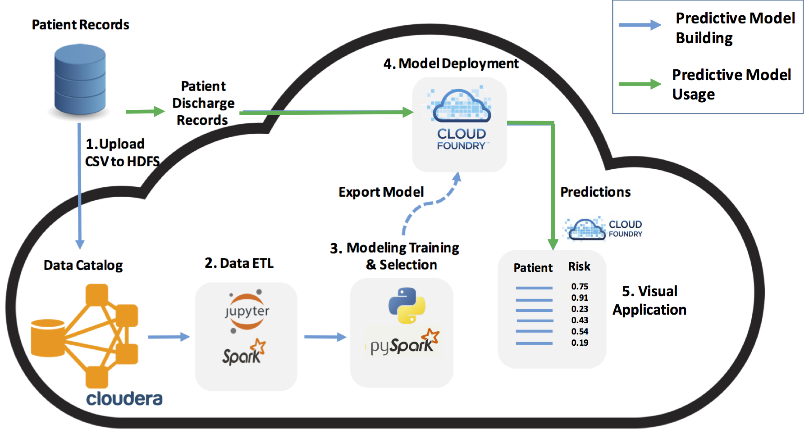

# Reducing Hospital Admissions
A reference architecture for using big data and machine learning to improve patient care with Intel’s Trusted Analytics Platform (TAP) 

## 1. The Problem

The Affordable Care Act established the Hospital Readmissions Reduction Program (HRRP), which requires the Centers for Medicare & Medicaid Services (CMS) to promote quality health care for Americans. To this end the CMS is required to reduce payments to hospitals with excessive readmissions. Additionally, hospitals incur unnecessary costs when patients are readmitted for conditions that could have been addressed or mitigated during the patient's initial admission. As a result, hospitals are seeking ways to reduce readmissions rates.

## 2. Executive Summary

The prevalence of large patient datasets and the computational resources now available via cloud computing gives data scientists the ability to find meaningful patterns in patient readmission data. From these patterns, models can be built which enable hospitals to identify the most at-risk patients before they are discharged and apply an appropriate intervention. Below are the specifics points that will be covered to demonstrate how Intel’s Trusted Analytics Platform (TAP) con solve the problem statement from Section 1:

  *	**Solution Overview**: TAP packages standard Open Source tools (e.g. Cloudera Hadoop, Docker, and Cloud Foundry) to create an integrated platform to quickly develop predictive models from large datasets and then deploy those models for use in applications.
  *	Reference Architecture: Data sources can be combined to train a predictive model with high accuracy on assessing likelihood of patient readmission. That model can be deployed as a service so that it’s predictions can be consumed by other applications (see figure 1).
  *	Reference Implementation: We have created a specific implementation of the Reference Architecture using the open source MIMIC-III medical dataset, complete with detailed explanations, walkthrough and code available at https://github.com/MichaelAHood/readmissions-risk-scorer.
  *	Adoption Plan for Your Own Implementation: The last step is a discussion of how a specific hospital can use the Reference Architecture to create their own implementation with their own data and existing applications. 
  * Reducing Readmissions Case Study: In conclusion, there is a case study that discusses how Intel helped a large hospital group successfully implement a readmissions reduction program using big data and machine learning.

The above diagram demonstrates the general process by which patient Electronic Medical Records (EMR) data can be combined with multiple data sources, such as census data, and socio-economic data to form a rich picture about patients. With a dataset on hand, data scientists can create predictive models that learn the relationships between patient data and their propensity for different conditions, e.g. heart disease or risk of early readmission.

## 3. How to Use the Solution

Once a predictive model has been created and validated, it can be deployed as a cloud-based service that allows the model's predictions to be consumed by other applications. For example, discharge planning software can pass a list of patient IDs to the model and receive a score that indicates the readmission risk for each patient. Once high-risk patients have been identified, their EMRs and discharge plans can be scrutinized to identify any risk factors that have been identified.

In this way, the model serves as a cognitive aid to assist hospital staff in identifying high-risk people who may have gone unnoticed.

## 4. What Does the Solution Contain

At it's core, TAP consists of three key open source technologies:

  1. **Cloudera Hadoop (CDH)**
  2. **Docker**
  3. **CloudFoundry**

This solution utilizes the above components by storing historical data and patient records in the CDH cluster. Data Scientists are able to analyze the data via the creation of Docker containers that contained virtual instances of Jupyter analytics notebooks, to enable collaborative and reproducible work. Additionally, Apache Spark -- the big data computing engine -- was utilized on the CDH cluster to analyze the datasets that were too big to fit into the memory. Spark was also used to train and validate the machine learning model for making predictions of high-risk patients. Finally, the trained model was packaged into an application and deployed in the TAP cloud as a CloudFoundry application.

## 5. Solution Background

This solution originated through Intel's partnership with Cloudera to conduct a pilot program with a Large Hospital Group to use predictive analytics to reduce readmission rates. 

Intel Data Scientists combined the hospital historical patient data with socioeconomic data, such as housing prices and health services in the surrounding area, to train a Random Forest predictive model that enabled doctors to pinpoint which patients were a high readmission risk. Hospital staff were able to administer additional care to identify any shortcomings in the treatment and discharge plan, thereby reducing overall readmission rates.

By Using the predictions from the analysis, the Hospital Group was able to reap the following benefits:

  1. **Reducing 6,000 occurrences of patient readmission.**
  2. **Avoiding $4 million in potential Medicare penalties.**
  3. **Saving approximately $72 million in medical costs.**
  4. **Improving hospital ratings by lowering readmission rate and increasing patient satisfaction.**
  5. **More efficient utilization of resources by focusing at high-risk patients.**

One of the unintended benefits of implementing this solution was more efficient utilization of resources. Specifically, the increased quality of care provided to the identified high-risk patients during their initial visit freed up resources that enabled the Hospital Group to help an additional 300 - 500% more patients.

We have provided a blueprint that enables any hospital organization to use TAP, adopt the above described solution, and begin reaping the same benefits.

## 6. Adoption Roadmap

This adoption roadmap for this solution consists of five essential steps:

1. **Identifying and loading the relevant data into the TAP cluster.**
2. **Explore, process, and engineer features for use in predictive modeling.**
3. **Pick a performance criteria and train a predictive model accordingly.**
4. **Deploy the predictive model as an API that can be used by another application.**
5. **Build an application that flags high-risk patients and allows practitioners to visualize relevant patient data.**

1. **Identifying and loading the relevant data into the TAP cluster.** At a minimum, the hospitals admission records are required to identify which patients were readmitted within a given time frame. Other sources of data, such as demographic information and comorbidity records, can enrich the patient readmission data, boosting model performance. Choosing which data to incorporate in a model can be as much a creative effort as it is an investigative one, and should be treated as an iterative development process. Subject Matter Experts (SMEs), IT professionals, and Data Scientists should be involved in this initial phase. Data can be loaded and stored in TAP in many forms that lend themselves to the individual preferences and needs of an IT and Analytics team. 

2. **Explore, process, and engineer features for use in predictive modeling.** This step involves creating the data pipeline that takes the data from the source defined in the previous step and prepares it for modeling. These steps will include initial Exploratory Data Analysis (EDA) to learn the structure of the data, determine if there are any dirty or missing data, how to clean and impute missing fields, and finally identify which data fields will be useful for modeling. A significant effort in this step is feature engineering, that is, the creation of new data features from pre-existing ones. Feature Engineering is another opportunity for SMEs, IT professionals, and data scientists to come together to brainstorm and discuss novel ideas and courses of action.

3. **Pick a performance criteria and train a predictive model accordingly.** This step entails considering the practical details of what a model is doing. No model is perfect and this fact requires that tradeoffs must be made since some patients will be incorrectly flagged by the model and other high-risk patients will be missed entirely. This requires that an analysis e done that considers the cost of false positives and false negatives – wasted time, unnecessary medical care, missing a high-risk patient – and the benefit of true positives – reducing readmissions. The stakeholders in this discussion are the healthcare professionals, operations planning staff, and data scientists. With appropriate performance criteria the data scientist can train and validate a model according to the specified criteria.

4. **Deploy the predictive model as an API that can be used by another application.** Once a model has been created it must be deployed in a format that enables other applications to consume the predictions it makes. From a development and integration standpoint the simplest way to do this is package the model as a service where it can be called like a REST API. This allows developers to only worry about the input and output of the model and ignore the internal details of how the model works.

5. **Build an application that flags high-risk patients and allows practitioners to visualize relevant patient data.** With the model available as a service, we need to give medical practitioners a way to utilize the model's predictions. Since the output of a model is just a number representing a risk score for readmission, it is helpful to provide contextual data to go with a given prediction, e.g. patient's weight, age, comorbidity scores, and socioeconomic data. With this supplemental data, hospital staff can view the model's prediction within the broader context of the overall population and use that data to augment their reasoning.

